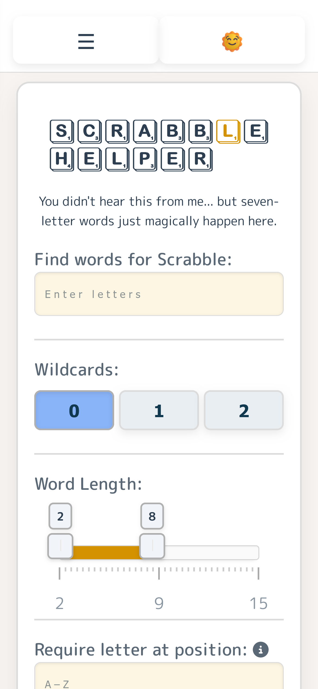
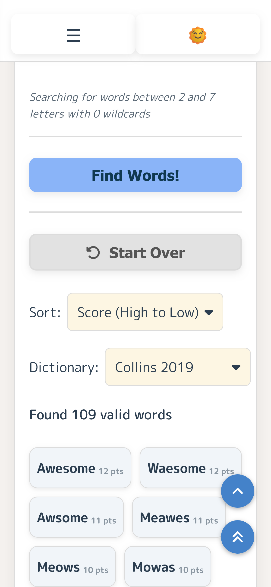
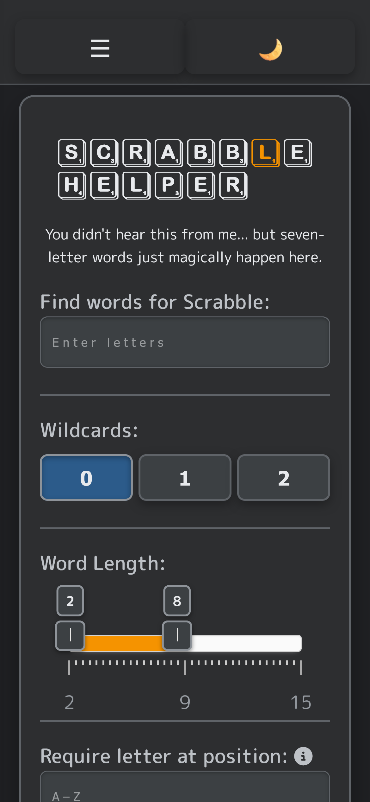
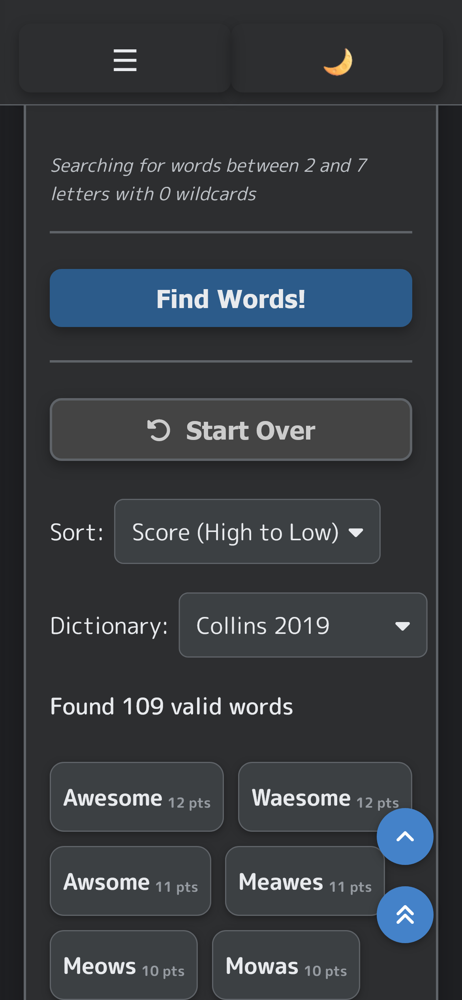

# 🧩 Scrabble Helper

**Scrabble Helper** is a fun, hobby-built web app designed to help you find valid Scrabble® words from a set of letters — perfect for friendly competition, personal practice, or just satisfying your inner word nerd.

It’s a *harmless little cheat* made to give you that “aha!” moment without the guilt — originally built to help me challenge my native-English-speaking partner!

[🌐 Live Site →](https://w0nght.github.io/scrabble_helper/)

---

## ✨ Features

- **Word Search with Multiple Filters**
  - Enter your available letters (A–Z).
  - Select **0–2 wildcards** using toggle buttons.
  - Filter by **minimum and maximum word length** with a dual range slider.
  - Require a specific letter at a specific position (e.g., `A3` = “A” in position 3).
- **Custom Dropdown Filters**
  - **Sort** results (Score, Length, Alphabetical).
  - **Dictionary** selection with caching for fast switching (Collins 2019, OTCWL 2016, SOWPODS).
- **Pagination**
  - Results display 30 at a time with a **Show More** button.
  - Additional results animate in with a smooth staggered effect.
- **Theme & Styling**
  - Light / Dark theme support.
  - Clean, responsive UI with Scrabble-style tiles and flip animations.
- **Performance & UX**
  - Loaded dictionaries are cached in memory for faster lookups.
  - Input sanitization and helpful error messages when no matches are found.

---

## 📸 Screenshots

Light theme: 
   
Dark theme: 
  

---

## 🚀 How to Use

1. **Open the app** in your browser.  
2. **Enter your letters** in the main input field.  
3. Adjust filters as needed:
   - **Wildcards:** select from zero to two.
   - **Word Length:** drag the min/max sliders.
   - **Required Letter & Position:** enter a format like `A3`.
4. Click **Find Words** — results will appear below with animations.  
5. Use the **Sort** and **Dictionary** dropdowns above the results to adjust your desired result on-the-go.  
6. Click **Show More** to reveal additional matches.

---

## 🛠️ Tech Stack

- HTML5
- CSS3 (Custom properties, animations, light/dark themes)
- JavaScript (ES6+)
- JSON (dictionary files)

---

## 🚧 Roadmap

- [ ] **Dictionary & Word Data**
  - Expand multiple dictionary support 
  - Show word definitions (via API) on click/hover  
- [ ] **Advanced Search Filters**
  - Exclude unwanted letters  
  - "Starts with" / "Ends with" filters  
  - Group results by word length (toggle option)  
  -  More granular wildcard handling (custom limit, position control)   
- [ ] Improved search performance & scalability  
- [ ] Progressive Web App (PWA) offline support  
- [ ] Mobile-first UI refinements & accessibility improvements  
---

## 📄 Disclaimer

Scrabble® is a registered trademark of Hasbro Inc. in the U.S. and Canada and of J.W. Spear & Sons Limited elsewhere.  
This project is not affiliated with, sponsored by, or endorsed by these trademark owners.  
It’s just a personal project made for fun — and maybe to win a few friendly games!

---

## 💡 Credits

- Dictionary data: [Collins Scrabble Words 2019](https://www.collinsdictionary.com/scrabble/word-list/english)  
- Dual range slider design inspiration: MarioD’s CodePen (used for UX ideas) (https://codepen.io/MarioD/pen/WwXbgr)

---

## 📫 Contact

For feedback or feature suggestions:

- [GitHub Issues](https://github.com/w0nght/scrabble_helper/issues)  
- [LinkedIn](https://www.linkedin.com/in/joey-wong-4-work/)  
- [GitHub](https://github.com/w0nght)  

---

## 🏷 Version

Current version: **v0.3.0**  
(See bottom of site for the latest commit tag info)

